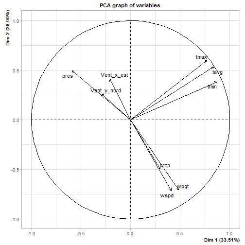

# Analyse de la qualité de l'air à rennes.


```r
# Chargement des packages utilisé dans la suite du script
library("data.table")
library("dplyr")
library("car")
```

```
## Warning: le package 'car' a été compilé avec la version R 4.1.3
```

```
## Le chargement a nécessité le package : carData
```

```
## Warning: le package 'carData' a été compilé avec la version R 4.1.2
```

```
## 
## Attachement du package : 'car'
```

```
## L'objet suivant est masqué depuis 'package:dplyr':
## 
##     recode
```

```r
library("FactoMineR")
```

```
## Warning: le package 'FactoMineR' a été compilé avec la version R 4.1.3
```

## a) Présentation des données

Les données météorologiques issues de Meteostat que nous avons
présentées dans les onglets 'Présentation' et illustrées dans les
onglets 'Carte interactive' et 'Données météo' représentent un ensemble
de 10 variables de type Float64.

| Variables |             Description              | Unité |
|:---------:|:------------------------------------:|:-----:|
|   tavg    |         Température moyenne          |  °C   |
|   tmin    |      Températrure minimum en °C      |  °C   |
|   tmax    |      Températrure maximum en °C      |  °C   |
|   prcp    |      Précipitation quotidienne       |  mm   |
|   snow    |        Profondeur de la neige        |  mm   |
|   wdir    |     la direction moyenne du vent     |   °   |
|   wspd    |     La vitesse moyenne du vente      | km/h  |
|   wpgt    |       Rafale de vent maximale        | km/h  |
|   pres    | Pression moyenne au niveau de la mer |  hPa  |
|   tsun    | Le total d'ensoleillement quotidien  |  min  |

Nous avons parallèlement récupéré des données de qualité de l'air issues
de Atmo France (Fédération des Associations agréées de surveillance de
la qualité de l'air).

Nous nous sommes particulièrement interessés à l'indice ATMO, qui est un
facteur à 6 modalités catégorielles : "Bon" , "Moyen", "Degradé",
"Mauvais", "Très mauvais" et "Extrèmement mauvais"

*" L'indice ATMO est calculé quotidiennement à l'échelle de chaque
commune ou au maximum à l'échelle intercommunale.\
Il est déterminé, à partir des concentrations de 5 [polluants
réglementés](https://www.atmo-france.org/article/air-exterieur "Air extérieur")
:*

-   *Les particules fines inférieures à 10 micromètres : les PM~10~ ;*

-   *Les particules fines inférieures à 2,5 micromètres : PM~2.5~ ;*

-   *Le dioxyde d'azote (NO~2~)*

-   *L'ozone (O~3~) ;*

-   *Le dioxyde de soufre (SO~2~)."* - Site Atmo-france.org

{width="539"}

[Table 1:]{.underline} tableau des seuil de calcul des indices ATMO pour
les 5 polluants indicateurs de la pollution - source: Site
Atmo-france.org

Nos but est de mettre en relation les données météorologiques avec
l'indice de la qualité de l'air; de voir si certaines variables
météorologiques permettent d'expliquer l'indice ATMO.

## b) Importation des données


```r
df <- read.csv("C:/Users/renax/Desktop/ACO/S9/Programmation_R/Projet_meteo/Projet_Shiny/data/quality_index_rennes.csv", header=TRUE)

set.seed(45L)
dt_qualite_air <- data.table(df) # transformation en datatable

summary(dt_qualite_air[,23:31]) # résumé pour les données meteo, pour verifier les classes des colonnes
```

```
##       tmin             tmax            prcp          snow              wdir      
##  Min.   :-5.600   Min.   : 2.50   Min.   : 0.000   Mode:logical   Min.   :  0.0  
##  1st Qu.: 4.600   1st Qu.:12.70   1st Qu.: 0.000   NA's:731       1st Qu.:113.0  
##  Median : 8.600   Median :18.20   Median : 0.000                  Median :209.0  
##  Mean   : 8.533   Mean   :18.26   Mean   : 1.718                  Mean   :193.8  
##  3rd Qu.:12.500   3rd Qu.:23.50   3rd Qu.: 1.300                  3rd Qu.:270.0  
##  Max.   :20.200   Max.   :40.50   Max.   :53.600                  Max.   :359.0  
##                                   NA's   :3                       NA's   :2      
##       wspd            wpgt            pres          tsun        
##  Min.   : 3.10   Min.   :11.10   Min.   : 986.9   Mode:logical  
##  1st Qu.: 9.30   1st Qu.:30.00   1st Qu.:1012.6   NA's:731      
##  Median :12.10   Median :37.00   Median :1018.2                 
##  Mean   :12.83   Mean   :38.91   Mean   :1018.0                 
##  3rd Qu.:15.80   3rd Qu.:46.00   3rd Qu.:1023.4                 
##  Max.   :36.00   Max.   :91.00   Max.   :1043.1                 
##  NA's   :2       NA's   :14      NA's   :2
```

La variable à expliquer est la colonne code_qual'. Il s'agit d'une
variable catégorielle avec 4 modalités : "1", "2", "3", "4",
correspondant respectivement aux catégories d'air "Bon", "Moyen",
"Dégradé" et "Mauvais".

Il est important de noter que dans notre jeu de données, l'indice ATMO
ne va que de Bon" à "Mauvais". Les modalités "Très mauvais" et
"Extrêmement mauvais" ne sont donc pas résentes pour la ville de Rennes
entre septembre 2021 et septembre 2022.

## c) Preparation des données

En vue de la création d'un modèle logistique, il nous faut traiter au
préalable nos données.

### i. Variable réponse

Gestion des NA:

On remarque dans le summary des données meteo qu'on retrouve des données
manquantes pour les colonnes rafales de vent (wgpt), precipitaition
(prcp), direction du vent (wdir) et pression (pres).

Nous decidons d'enlever les lignes qui présente des données manquantes.


```r
# pour wdir
dt_qualite_air <- dt_qualite_air[which(! is.na(dt_qualite_air$wpgt)),]
dt_qualite_air <- dt_qualite_air[which(! is.na(dt_qualite_air$prcp)),]

# summary(dt_qualite_air[,23:31])
```

Les recommandations comportementales établies par le ministère en charge
de la Santé sont associées aux différents qualificatifs de l'indice
ATMO. Les recommandations distinguent deux situations: les indices "Bon
(1)" ou "Mauvais (2)" et les indices "Degradé (3)" à "Extrèmement
Mauvais (6)". Dans le premier cas, il existe des recommandations
d'avantage préventive, et dans le deuxième cas il y a des
recommandations plus rudes pour reduire l'impact de la pollution sur la
santé et sur l'environnement.

A des fins de traitement statistique, nous décidons alors de regrouper
les catégories 1 et 2 entre elles et les catégories 3 et 4 entre elles
dans la nouvelle colonne *qualite_air_groupe:*


```r
# creation de la colonnes qualite_air_groupe
dt_qualite_air[, qualite_air_groupe := ifelse(code_qual %in% c(1, 2), "Groupe 1-2",
                                   ifelse(code_qual %in% c(3, 4), "Groupe 3-4", "Other"))]

dt_qualite_air$qualite_air_groupe<- as.factor(dt_qualite_air$qualite_air_groupe)
```

Notre variable à expliquer est désormais la colonne *qualite_air_groupe
l'air* qui a 2 modalités: "Groupe 1-2" et "Groupe 3-4".

### ii. Variables explicatives

La variable de direction du vent *wdir* ( ° ) nous interpelle car son
unité étant des degrés, nous avons une situation dans laquelle notre
modèle va éloigner les valeur 0° et 360° alors que ce sont les meme.
Idem pour les valeurs 5° et 355°, le modèle va les considérer comme très
éloignées alors qu'en réalité la direction du vent n'est différente que
de 10° .

Pour palier à cas, nous convertissons les degrés en une représentation
plus adaptée pour notre modèle logistique. Nous récuperons les
composantes x et y de la direction du vent par quelques traitements
trigonométriques:


```r
# Convertir les degrés en radians
dt_qualite_air <- dt_qualite_air %>%
  mutate(Angle_radians = wdir * pi / 180)

# Calculer les composantes x et y de la direction du vent
dt_qualite_air <- dt_qualite_air %>%
  mutate(Vent_x_est = cos(Angle_radians),
         Vent_y_nord = sin(Angle_radians))
```

Avant de créer notre premier modèle nous remarquons que parmis nos
données explicatives potentielles, certaines sont liées. La température
moyenne est instrinsèquement liée à la température minimale et la
température maximale. Ainsi, par principe de parcimonie nous ne gardons
que la température moyenne sur les 3 variables de température.

## d) Visualisation des données en anayse factorielle

Afin d'avoir une vue d'esmble des variables explicatives et de la
Variable réponse, nous faisons une ACP sur variables explicatives. Nous
rajoutons en supplémentaire la variables *qualite_air_groupe* afin de
determiner si elle se positioner de manière particulière face aux
varibles et aux individus.


```r
# Selection des colonnes qui nous interesse i.e les variables explicatives et la variable réponse
res<- PCA(dt_qualite_air[, c(22,23,24,25,28,29,30,32,34,35)],scale.unit = TRUE, quali.sup = 8)
```



```r
# enlever wdir

# Afficher le graphique PCA
plot(res, habillage = 8, label = "none")
```


On vois sur le graph des individus colorés par groupe de qualité de
l'air que le groupe 1-2 se réparti le long des deux première dimension
de manière assez homogène. Les individus des groupes 3-4 sont legèrement
plus vers la gauche du graphique, et se répartisse de manière homogène
le long de la deuxième dimension. On retouve cela avec le barycentre des
groupes 1-2 et 3-4 qui sont environ aux meme coordonées sur la deuxième
dimension mais qui sont un peu différents sur la première

On peut donc supposer que les variables contribuant le plus à la
première dimension pourraient nous donner des informations sur la
qualité de l'air. Il est cependant difficile de séparer complètement les
deux groupes d'individus.

## e) Création des modèles

Nous faisons dans un premier temps un modèle logistique complet avec
l'ensemble des variables explicatives, et nous cherchons un modèle final
par le biais d'une selection de modèle par élimination descendante avec
un critère de test de rapport de vraissemblance (Likelihood Ratio Test).

ichez les résultats de l'ANOVA

print(resultat_anova)


```r
# 1. Ajustez le modèle complet
mod_complet <- glm(qualite_air_groupe ~ tavg + prcp + wspd + wpgt + pres + Vent_x_est + Vent_y_nord, data = dt_qualite_air, family = "binomial")

# 2. Ajustez le modèle 2 (sans la variable 'wpgt')
mod_2 <- glm(qualite_air_groupe ~ tavg + prcp + wspd + pres + Vent_x_est + Vent_y_nord, data = dt_qualite_air, family = "binomial")

# 3. Comparez les deux modèles en utilisant la fonction anova()
anova(mod_complet, mod_2, test="F")
```

```
## Warning: using F test with a 'binomial' family is inappropriate
```

```
## Analysis of Deviance Table
## 
## Model 1: qualite_air_groupe ~ tavg + prcp + wspd + wpgt + pres + Vent_x_est + 
##     Vent_y_nord
## Model 2: qualite_air_groupe ~ tavg + prcp + wspd + pres + Vent_x_est + 
##     Vent_y_nord
##   Resid. Df Resid. Dev Df   Deviance      F Pr(>F)
## 1       706     611.45                            
## 2       707     611.46 -1 -0.0056465 0.0056 0.9401
```

```r
summary(mod_2)
```

```
## 
## Call:
## glm(formula = qualite_air_groupe ~ tavg + prcp + wspd + pres + 
##     Vent_x_est + Vent_y_nord, family = "binomial", data = dt_qualite_air)
## 
## Deviance Residuals: 
##      Min        1Q    Median        3Q       Max  
## -1.86363  -0.69601  -0.39066  -0.06969   2.99968  
## 
## Coefficients:
##             Estimate Std. Error z value Pr(>|z|)    
## (Intercept) 11.67672   15.09417   0.774   0.4392    
## tavg         0.03554    0.01646   2.159   0.0308 *  
## prcp        -0.20390    0.07977  -2.556   0.0106 *  
## wspd        -0.11917    0.02736  -4.355 1.33e-05 ***
## pres        -0.01156    0.01465  -0.789   0.4302    
## Vent_x_est   0.68605    0.14312   4.793 1.64e-06 ***
## Vent_y_nord  1.23734    0.16293   7.594 3.10e-14 ***
## ---
## Signif. codes:  0 '***' 0.001 '**' 0.01 '*' 0.05 '.' 0.1 ' ' 1
## 
## (Dispersion parameter for binomial family taken to be 1)
## 
##     Null deviance: 779.11  on 713  degrees of freedom
## Residual deviance: 611.46  on 707  degrees of freedom
## AIC: 625.46
## 
## Number of Fisher Scoring iterations: 6
```

```r
## On recommence avec un autre modèle où on enlève pres
mod_3 <- glm(qualite_air_groupe ~ tavg + prcp + wspd + Vent_x_est + Vent_y_nord, data = dt_qualite_air, family = "binomial")

anova(mod_2, mod_3, test="F")
```

```
## Warning: using F test with a 'binomial' family is inappropriate
```

```
## Analysis of Deviance Table
## 
## Model 1: qualite_air_groupe ~ tavg + prcp + wspd + pres + Vent_x_est + 
##     Vent_y_nord
## Model 2: qualite_air_groupe ~ tavg + prcp + wspd + Vent_x_est + Vent_y_nord
##   Resid. Df Resid. Dev Df Deviance      F Pr(>F)
## 1       707     611.46                          
## 2       708     612.08 -1 -0.62032 0.6203 0.4309
```

```r
# on garde le modèle 3
summary(mod_3)
```

```
## 
## Call:
## glm(formula = qualite_air_groupe ~ tavg + prcp + wspd + Vent_x_est + 
##     Vent_y_nord, family = "binomial", data = dt_qualite_air)
## 
## Deviance Residuals: 
##      Min        1Q    Median        3Q       Max  
## -1.79972  -0.70067  -0.39618  -0.07013   2.97974  
## 
## Coefficients:
##             Estimate Std. Error z value Pr(>|z|)    
## (Intercept) -0.22836    0.36276  -0.630   0.5290    
## tavg         0.03991    0.01555   2.567   0.0103 *  
## prcp        -0.18923    0.07629  -2.480   0.0131 *  
## wspd        -0.11477    0.02678  -4.285 1.83e-05 ***
## Vent_x_est   0.65935    0.13888   4.748 2.06e-06 ***
## Vent_y_nord  1.22971    0.16244   7.570 3.73e-14 ***
## ---
## Signif. codes:  0 '***' 0.001 '**' 0.01 '*' 0.05 '.' 0.1 ' ' 1
## 
## (Dispersion parameter for binomial family taken to be 1)
## 
##     Null deviance: 779.11  on 713  degrees of freedom
## Residual deviance: 612.08  on 708  degrees of freedom
## AIC: 624.08
## 
## Number of Fisher Scoring iterations: 6
```

Tous les paramètres de notre modèles sont significatifs.

Regardons en detail les effets de ces variables.D'après le résumé, on
retrouve que:

-   La pression atmosphérique et les bourasques de vent ne sont pas
    associées à la probabilité de bonne ou mauvaise qualité de l'air
-   L'augmentation de la température moyenne (tavg) est associée à
    l'augmentation de la probabilité de mauvaise qualité de l'air par
    rapport à la bonne qualité de l'air
-   A l'inverse, une augmentation des précipitation et de la vitesse du
    vent est associée à une augmentation de la probabilité de bonne
    qualité de l'air
-   Pour les valeurs de vents, on reprend les transformations
    trigonométriques qui nous avaient permis de créer ces variables, et
    on retrouve qu'une augmentation de vent_x et de vent_y, donc un vent
    vers l'est et vers le nord est associé à une augmentation de la
    probabilité de bonne qualité de l'air. Aussi, puisque le coefficient
    est deux fois superieur pour vent_y, on peut dire que la direction
    du vent associé à une augmentation de la probabilité de bonne
    qualité de l'air est NNE.

## Conclusion

Notre modèle suggère que la pluie, la température et le vent (la
direction et la vitesse) ont une influence sur l'indice ATMO, qui rend
compte de la qualité de l'air. La météo semble ainsi pouvoir expliquer
du moins en partie la qualité de l'air. Les bourasques de vents et la
pression atmosphérique n'ont pas d'influence sur l'indice ATMO.

Les informations que nous avons mises en évidence sont des premiers
resultats et de nombreux facteurs, d'avantage liés à la cause des
emission des gaz polluants pourraient permettre de mieux comprendre
l'indice de ATMO.

La meteo nous permet ainsi d'expliquer en partie la qualité de l'air, et
ainsi, il semblerait être possible de prévoir la qualité de l'air, avec
des informations sur les emissions de polluants croisées avec des
données météo prévues par les institutions spécialisées.
