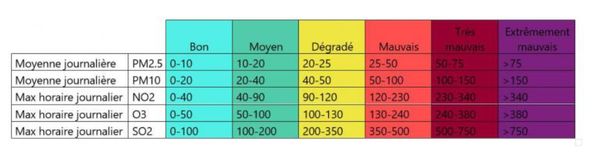
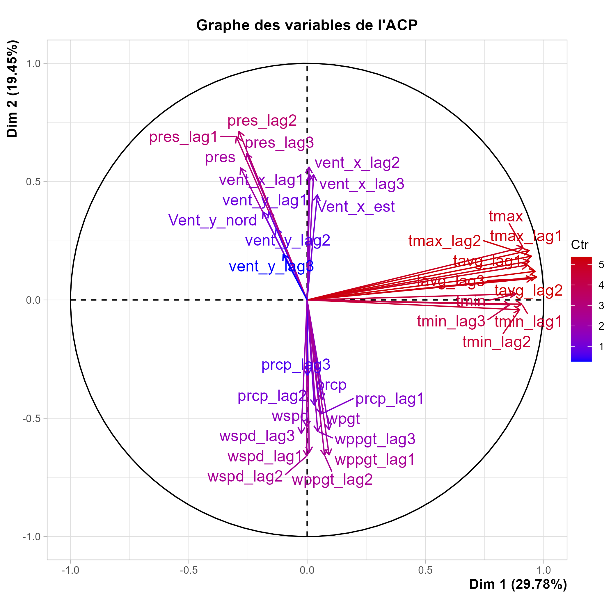
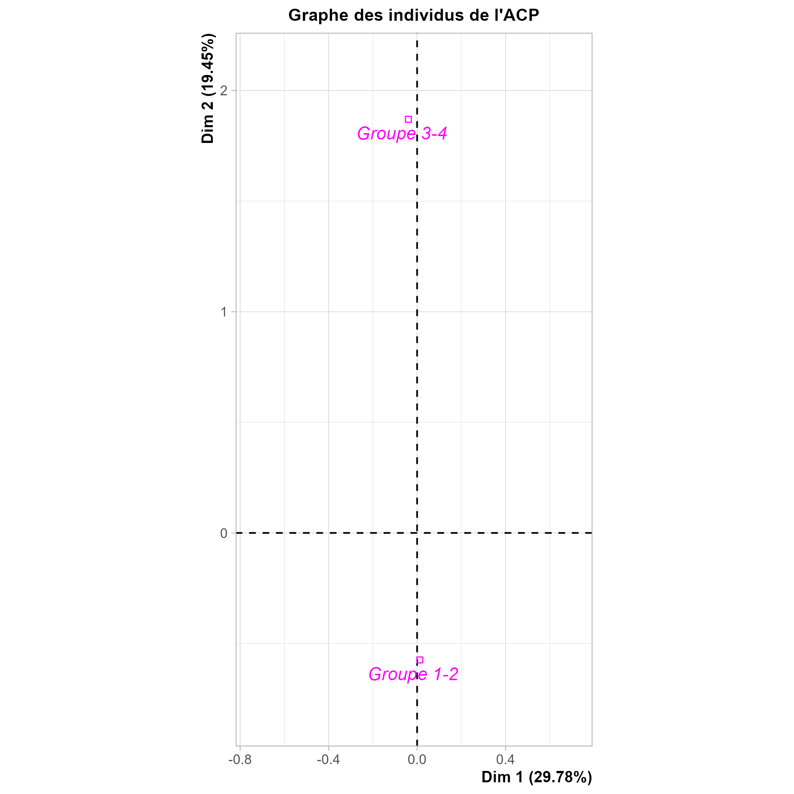

# Analyse de la qualité de l'air à rennes.

```{r}
# Chargement des packages utilisé dans la suite du script
library("data.table")
library("dplyr")
library("car")
library("FactoMineR")
```

## a) Présentation des données

Les données météorologiques issues de Meteostat que nous avons
présentées dans les onglets 'Présentation' et illustrées dans les
onglets 'Carte interactive' et 'Données météo' représentent un ensemble
de 10 variables de type Float64.

| Variables |             Description              | Unité |
|:---------:|:------------------------------------:|:-----:|
|   tavg    |         Température moyenne          |  °C   |
|   tmin    |      Températrure minimum en °C      |  °C   |
|   tmax    |      Températrure maximum en °C      |  °C   |
|   prcp    |      Précipitation quotidienne       |  mm   |
|   snow    |        Profondeur de la neige        |  mm   |
|   wdir    |     la direction moyenne du vent     |   °   |
|   wspd    |     La vitesse moyenne du vente      | km/h  |
|   wpgt    |       Rafale de vent maximale        | km/h  |
|   pres    | Pression moyenne au niveau de la mer |  hPa  |
|   tsun    | Le total d'ensoleillement quotidien  |  min  |

Nous avons parallèlement récupéré des données de qualité de l'air issues
de Atmo France (Fédération des Associations agréées de surveillance de
la qualité de l'air).

Nous nous sommes particulièrement interessés à l'indice ATMO, qui est un
facteur à 6 modalités catégorielles : "Bon" , "Moyen", "Degradé",
"Mauvais", "Très mauvais" et "Extrèmement mauvais"

*" L'indice ATMO est calculé quotidiennement à l'échelle de chaque
commune ou au maximum à l'échelle intercommunale.\
Il est déterminé, à partir des concentrations de 5 [polluants
réglementés](https://www.atmo-france.org/article/air-exterieur "Air extérieur")
:*

-   *Les particules fines inférieures à 10 micromètres : les PM~10~ ;*

-   *Les particules fines inférieures à 2,5 micromètres : PM~2.5~ ;*

-   *Le dioxyde d'azote (NO~2~)*

-   *L'ozone (O~3~) ;*

-   *Le dioxyde de soufre (SO~2~)."* - Site Atmo-france.org



[Table 1:]{.underline} tableau des seuil de calcul des indices ATMO pour
les 5 polluants indicateurs de la pollution - source: Site
Atmo-france.org

Nos but est de mettre en relation les données météorologiques avec
l'indice de la qualité de l'air; de voir si certaines variables
météorologiques permettent d'expliquer l'indice ATMO.

## b) Importation des données

```{r}
path='../data/quality_index_rennes.csv'
df <- read.csv( path, header=TRUE)

set.seed(45L)
dt_qualite_air <- data.table(df) # transformation en datatable

# summary(dt_qualite_air[,23:31]) # résumé pour les données meteo, pour verifier les classes des colonnes
```

La variable à expliquer est la colonne code_qual'. Il s'agit d'une
variable catégorielle avec 4 modalités : "1", "2", "3", "4",
correspondant respectivement aux catégories d'air "Bon", "Moyen",
"Dégradé" et "Mauvais".

Il est important de noter que dans notre jeu de données, l'indice ATMO
ne va que de Bon" à "Mauvais". Les modalités "Très mauvais" et
"Extrêmement mauvais" ne sont donc pas résentes pour la ville de Rennes
entre septembre 2021 et septembre 2022.

## c) Preparation des données

En vue de la création d'un modèle logistique, il nous faut traiter au
préalable nos données.

### i. Variable réponse

Gestion des NA:

On remarque dans le summary des données meteo qu'on retrouve des données
manquantes pour les colonnes rafales de vent (wgpt), precipitaition
(prcp), direction du vent (wdir) et pression (pres).

Nous decidons d'enlever les lignes qui présente des données manquantes.

```{r}
# pour wdir
dt_qualite_air <- dt_qualite_air[which(! is.na(dt_qualite_air$wpgt)),]
dt_qualite_air <- dt_qualite_air[which(! is.na(dt_qualite_air$prcp)),]

# summary(dt_qualite_air[,23:31])
```

Les recommandations comportementales établies par le ministère en charge
de la Santé sont associées aux différents qualificatifs de l'indice
ATMO. Les recommandations distinguent deux situations: les indices "Bon
(1)" ou "Mauvais (2)" et les indices "Degradé (3)" à "Extrèmement
Mauvais (6)". Dans le premier cas, il existe des recommandations
d'avantage préventive, et dans le deuxième cas il y a des
recommandations plus rudes pour reduire l'impact de la pollution sur la
santé et sur l'environnement.

A des fins de traitement statistique, nous décidons alors de regrouper
les catégories 1 et 2 entre elles et les catégories 3 et 4 entre elles
dans la nouvelle colonne *qualite_air_groupe:*

```{r}
# creation de la colonnes qualite_air_groupe
dt_qualite_air[, qualite_air_groupe := ifelse(code_qual %in% c(1, 2), "Groupe 1-2",
                                   ifelse(code_qual %in% c(3, 4), "Groupe 3-4", "Other"))]

dt_qualite_air$qualite_air_groupe<- as.factor(dt_qualite_air$qualite_air_groupe)
```

Notre variable à expliquer est désormais la colonne *qualite_air_groupe
l'air* qui a 2 modalités: "Groupe 1-2" et "Groupe 3-4".

### ii. Variables explicatives

La variable de direction du vent *wdir* ( ° ) nous interpelle car son
unité étant des degrés, nous avons une situation dans laquelle notre
modèle va éloigner les valeur 0° et 360° alors que ce sont les meme.
Idem pour les valeurs 5° et 355°, le modèle va les considérer comme très
éloignées alors qu'en réalité la direction du vent n'est différente que
de 10° .

Pour palier à cas, nous convertissons les degrés en une représentation
plus adaptée pour notre modèle logistique. Nous récuperons les
composantes x et y de la direction du vent par quelques traitements
trigonométriques:

```{r}
# Convertir les degrés en radians
dt_qualite_air <- dt_qualite_air %>%
  mutate(Angle_radians = wdir * pi / 180)

# Calculer les composantes x et y de la direction du vent
dt_qualite_air <- dt_qualite_air %>%
  mutate(Vent_x_est = cos(Angle_radians),
         Vent_y_nord = sin(Angle_radians))
```

Avant de créer notre premier modèle nous remarquons que parmis nos
données explicatives potentielles, certaines sont liées. La température
moyenne est instrinsèquement liée à la température minimale et la
température maximale. Ainsi, par principe de parcimonie nous ne gardons
que la température moyenne sur les 3 variables de température.

Nous créons en plus, des données de lag qui permettent de prendre en
compte les 3 jours précédents le jours à prévoir:

```{r}
datameteo<-dt_qualite_air[,c(22:25,28:30,34,35)]
donnees_lagues1 <- datameteo %>%
  mutate_all(~lag(.))
colnames(donnees_lagues1) <- c("tavg_lag1","tmin_lag1","tmax_lag1","prcp_lag1", "wspd_lag1","wppgt_lag1", "pres_lag1", "vent_x_lag1","vent_y_lag1")             

donnees_lagues2 <- donnees_lagues1 %>%
  mutate_all(~lag(.))
colnames(donnees_lagues2) <- c("tavg_lag2","tmin_lag2","tmax_lag2","prcp_lag2", "wspd_lag2","wppgt_lag2", "pres_lag2", "vent_x_lag2","vent_y_lag2")              


donnees_lagues3 <- donnees_lagues2 %>%
  mutate_all(~lag(.))
colnames(donnees_lagues3) <- c("tavg_lag3","tmin_lag3","tmax_lag3","prcp_lag3", "wspd_lag3","wppgt_lag3", "pres_lag3", "vent_x_lag3","vent_y_lag3")             


# on juxtapose ces dataframe au tableau initial:
dt_qualite_air <- cbind(dt_qualite_air, donnees_lagues1)
dt_qualite_air <- cbind(dt_qualite_air, donnees_lagues2)
dt_qualite_air <- cbind(dt_qualite_air, donnees_lagues3)

# on enlève les 3 premières lignes car elles contiennent des NA:
dt_qualite_air <- dt_qualite_air[-c(1:3),]
```

## d) Visualisation des données en analyse factorielle

Afin d'avoir une vue d'esmble des variables explicatives et de la
Variable réponse, nous faisons une ACP sur variables explicatives. Nous
rajoutons en supplémentaire la variables *qualite_air_groupe* afin de
determiner si elle se positioner de manière particulière face aux
varibles et aux individus.

```{r}
# Selection des colonnes qui nous interesse i.e les variables explicatives et la variable réponse
library(Factoshiny)

# Factoshiny(dt_qualite_air[, c(22:25,28:30,32,34:62)])

```

{width="322"}{width="310"}
.png){width="526"}

La première dimension permet de bien séparer les individus, qui sont les
jours selon un axe horizontal.

En comparant avec le graphique des variables, ce sont les variables de
température qui participent à la création de l'axe 1. Alors les jours
sont bien séparés selon leur température (été/hiver), mais ne semblent
pas nous indiquer particulièrement sur la qualité de l'air.

En effet, on voit sur le graphique des individus colorés par groupe de
qualité de l'air que le groupe 1-2 se répartit le long des deux
premières dimensions de manière assez homogène. Les individus des
groupes 3-4 sont légèrement plus vers le haut du graphique et les
individus du groupe 1-2 plutôt vers le bas, mais les deux groupes se
répartissent de manière homogène le long de la première dimension. On
retrouve cela avec le barycentre des groupes 1-2 et 3-4 qui sont environ
aux mêmes coordonnées sur la première dimension mais qui sont un peu
séparés sur la deuxième.

On peut donc supposer que les variables contribuant le plus à la
deuxième dimension pourraient nous donner des informations sur la
qualité de l'air. Ces variables sont la précipitation en corrélation
positive et le vent en corrélation négative avec l'axe de la deuxième
dimension. Le groupe 1-2, de bonne qualité de l'air est ainsi davantage
lié à des fortes précipitations et des directions de vent particulières,
et inversement pour le groupe 3-4, associé à une moins bonne qualité de
l'air.

Il est cependant difficile de séparer complètement les deux groupes
d'individus.

## e) Création des modèles

Nous faisons dans un premier temps un modèle logistique complet avec
l'ensemble des variables explicatives, et nous cherchons un modèle final
par grace au critère d'AIC.

```{r}
datamod=dt_qualite_air[, c(22:25,28:30,32,34:62)]
# 1. Ajustement du modèle complet
mod_complet <- glm(qualite_air_groupe ~ ., data = datamod, family = "binomial")
summary(mod_complet)


# 2. Selection du modèle par AIC:

library(RcmdrMisc)
stepwise(mod_complet,direction="forward/backward",criterion="AIC",trace=FALSE)

modfinal<- glm(formula = qualite_air_groupe ~ vent_x_lag2 + Vent_y_nord + 
     wspd + vent_y_lag2 + tmax + tavg + vent_x_lag1 + vent_y_lag1 + 
     prcp + tmin_lag3 + vent_y_lag3, family = "binomial", data = datamod)

summary(modfinal)

```

Avec le critère d'AIC, on trouve un modèle à 11 paramètres, dont les
effets sont tous significatifs au seuil de 0.10, et avec 8 paramètres
dont les effets sont significatifs au seuil de 0.05.

Regardons en détail les effets de ces variables. D'après le résumé, on
retrouve que :

-   (\*\*\*) Les deux paramètres qui semblent expliquer au mieux la
    qualité de l'air sont la vitesse du vent et la direction du vent en
    y, c'est-à-dire vers le nord. Une augmentation de la vitesse du vent
    en y, donc un vent du nord, est associée à une diminution de la
    probabilité d'une bonne qualité de l'air. Pour la vitesse du vent,
    une augmentation de cette dernière est associée à une diminution de
    la probabilité d'une bonne qualité de l'air.

-   (\*\*) Les autres variables qui ont des effets sont significatifs
    concernent à la fois les données du jour (tmax), les données de la
    veille (vent_x_lag_1), et les données de l'avant veille
    (vent_x_lag_2). L'interprétation des paramètres par paramètres est
    analogue au paragraphe ci dessus.

-   (\* et .) En regardant les niveaux de significativité plus grands et
    si on accepte un niveau de significativité de 0.10, on retrouve des
    variables de 3 jours avant parmis les variables avec un effet
    significatif (tmin_lag2, vent_y_lag3)

-   La pression atmosphérique et les bourasques de vent ne sont jamais
    associées à la probabilité de bonne ou mauvaise qualité de l'air.

-   En résumé, les variables participant le mieux à expliquer la qualité
    de l'air sont les variables qualifiant el vent du jour, de la
    veille, et meme des jours précédents. On aura globalement un vent
    vers le Nord et l'Est qui sera associé à une probabilité de bonne
    qualité de l'air. En plus du vent, la précipitation du jour et la
    tempétature du jour expliquent la qualité de l'air dans notre
    modèle: de fortes précipitations et des petites températures
    maximales sont associées à une bonne qualité de l'air.

## Conclusion

Notre modèle suggère que la pluie, la température et le vent (la
direction et la vitesse) ont une influence sur l'indice ATMO, qui rend
compte de la qualité de l'air. Il nous a semblé interessant de prendre
en compte les jours précédent la mesure de la qualité de l'air, et
certaines variables de la veille avant veille et meme avant ont des
effets significatifs. La météo semble ainsi pouvoir expliquer du moins
en partie la qualité de l'air. Les bourasques de vents et la pression
atmosphérique n'ont pas d'influence sur l'indice ATMO.

Les informations que nous avons mises en évidence sont des premiers
resultats et de nombreux facteurs, d'avantage liés à la cause des
emission des gaz polluants pourraient permettre de mieux comprendre
l'indice de ATMO.

La météo nous permet ainsi d'expliquer en partie la qualité de l'air, et
ainsi, il semblerait être possible de prévoir la qualité de l'air, avec
des informations sur les emissions de polluants croisées avec des
données météo prévues par les institutions spécialisées.
